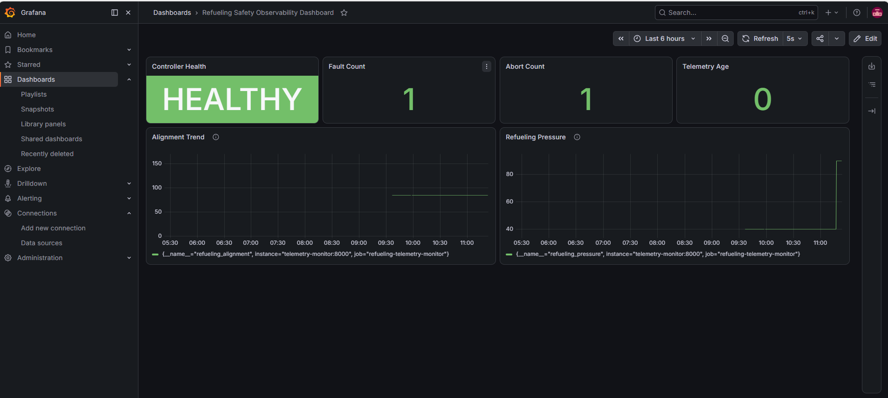
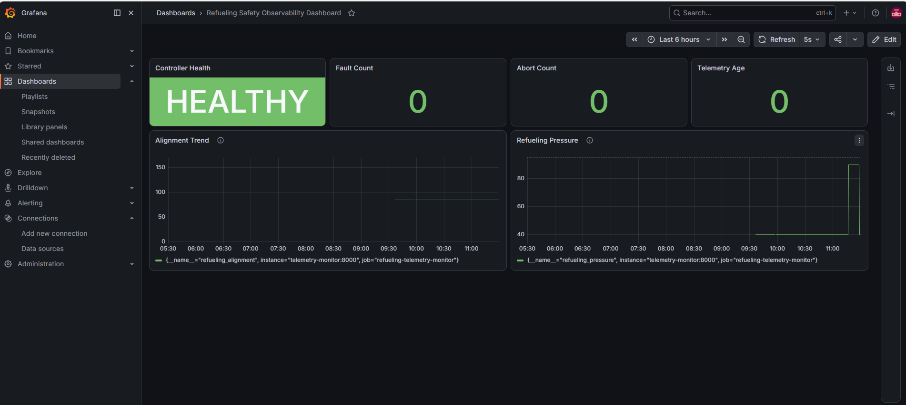

# Refueling Safety Observability Platform

A portfolio project that extends a deterministic C-based **Spacecraft Refueling Safety Simulation** into a local observability and incident-response platform.

The project demonstrates how a safety-oriented controller can be monitored through controller-generated telemetry, a Python telemetry adapter, Prometheus metrics, Grafana dashboards, Docker Compose, incident runbooks, and an Agile-style GitHub workflow.

> This is a software-in-the-loop portfolio simulation. It is not intended for real spacecraft operation or hardware control.

---

## Current Status

**Current stage: MVP Phase 1 — Local Observability (Sprint 1 closeout)**

### Completed

- Imported, built, and validated the original C refueling controller
- Restored automatic safety checks during controller command processing
- Created a Python FastAPI telemetry monitor
- Added `GET /health` and Prometheus-compatible `GET /metrics` endpoints
- Added a telemetry parser for controller-generated `TLM` output
- Added a simulator client that starts the C controller and exchanges commands through standard input and output
- Added multi-command scenario execution within one controller process
- Configured Prometheus to scrape telemetry every 5 seconds
- Built a Grafana dashboard for controller health and telemetry visualization
- Added Docker Compose for the telemetry monitor, Prometheus, and Grafana
- Added persistent Grafana storage through a named Docker volume
- Added selectable `reset` and `pressure_high` simulator scenarios
- Verified the pressure-high safety-abort path
- Added Grafana evidence for the faulted and recovered states
- Added a pressure-high incident runbook
- Used GitHub Issues, Projects, and sprint-style milestones to track development

### In Progress

- Sprint 1 review and retrospective
- Telemetry-timeout incident runbook
- README and evidence cleanup

### Planned Next

- Persistent long-running simulator process
- Background telemetry reader
- Continuous telemetry updates instead of replaying a scenario on each scrape
- Alert rules
- Event-driven telemetry using MQTT or another pub/sub mechanism

---

## Project Background

The original project was a spacecraft refueling safety simulation built around a deterministic C controller.

The controller manages refueling states, validates operating conditions, emits telemetry, records fault events, and enters a safe abort state when a safety rule is violated.

This project extends that controller into an observability platform closer to real-world Cloud SRE and platform-reliability workflows.

---

## Current Architecture

```text
Prometheus scrape request
          ↓
Python FastAPI Telemetry Monitor
          ↓
Scenario selector
   ├── reset
   └── pressure_high
          ↓
Python simulator client
          ↓
C Refueling Controller process
          ↓
Controller TLM output
          ↓
Telemetry parser
          ↓
Prometheus-compatible metrics
          ↓
Prometheus
          ↓
Grafana Dashboard
```

The current implementation uses controller-generated telemetry rather than hard-coded demo metric values.

For each `/metrics` scrape, the telemetry monitor currently:

1. Starts a new C controller process.
2. Sends the command sequence for the selected scenario.
3. Reads the controller telemetry output.
4. Parses the final telemetry sample.
5. Updates the Prometheus gauges.
6. Terminates the controller process.

> This is controlled software-in-the-loop telemetry. It is not continuous hardware telemetry.

---

## Safety-Control Boundary

The deterministic C controller remains responsible for:

- State transitions
- Pressure validation
- Alignment validation
- Fault detection
- Gate control
- Abort behavior
- Event logging

The Python service, Prometheus, Grafana, and any future AI features only observe, export, visualize, or summarize controller behavior.

AI does not control the refueling process and does not make safety-critical decisions.

---

## Technology Stack

- C
- Python
- FastAPI
- `prometheus-client`
- Prometheus
- Grafana
- Docker
- Docker Compose
- Git and GitHub

### Planned Extensions

- MQTT or another pub/sub telemetry layer
- Alertmanager
- AWS EC2, S3, CloudWatch, Lambda, and SNS
- Kubernetes
- Go health-check service
- Optional AI-assisted incident triage

---

## Simulator Scenarios

The active simulator scenario is selected with the `SIMULATOR_SCENARIO` environment variable in `docker-compose.yml`.

### Reset Scenario

```yaml
environment:
  RUNNING_IN_DOCKER: "true"
  SIMULATOR_SCENARIO: "reset"
```

Expected final state:

```text
STATE=IDLE
ALIGN=85
PRESSURE=40
FUEL=0
DOCK=0
GATE=CLOSED
FAULT=NONE
```

Expected dashboard indicators:

- Controller Health: `HEALTHY`
- Fault Count: `0`
- Abort Count: `0`
- Alignment: `85`
- Pressure: `40`

### Pressure-High Scenario

```yaml
environment:
  RUNNING_IN_DOCKER: "true"
  SIMULATOR_SCENARIO: "pressure_high"
```

The scenario executes:

```text
RESET
START_APPROACH
CHECK_ALIGNMENT
LOCK_DOCK
OPEN_GATE
CHECK_PRESSURE
START_REFUEL
SIM_PRESSURE 90
```

The deterministic controller defines the safe pressure range as:

```text
Minimum safe pressure: 20
Maximum safe pressure: 80
```

Injecting pressure `90` should produce:

```text
ACK,ABORT_ENTERING_SAFE_MODE,CAUSE=PRESSURE_OUT_OF_RANGE
```

Expected final telemetry:

```text
TLM,STATE=ABORT,ALIGN=85,PRESSURE=90,FUEL=0,DOCK=1,GATE=CLOSED,FAULT=PRESSURE_OUT_OF_RANGE
```

Expected safety behavior:

- Controller state changes to `ABORT`
- Refueling gate closes
- Fault becomes `PRESSURE_OUT_OF_RANGE`
- Event log records `ABORT_PRESSURE_OUT_OF_RANGE`

---

## Implemented Endpoints

### Health Endpoint

```text
GET http://localhost:8000/health
```

Example reset response:

```json
{
  "status": "ok",
  "simulator_scenario": "reset"
}
```

Example pressure-high response:

```json
{
  "status": "ok",
  "simulator_scenario": "pressure_high"
}
```

The health endpoint reports whether the telemetry service is operating and identifies the selected scenario.

A healthy telemetry service does not necessarily mean the controller has no active fault.

### Metrics Endpoint

```text
GET http://localhost:8000/metrics
```

Example reset metrics:

```text
refueling_alignment 85.0
refueling_pressure 40.0
refueling_fuel_level 0.0
refueling_docked 0.0
refueling_gate_open 0.0
refueling_fault_count 0.0
refueling_abort_count 0.0
refueling_controller_health 1.0
refueling_telemetry_age_seconds 0.0
```

Example pressure-high metrics:

```text
refueling_alignment 85.0
refueling_pressure 90.0
refueling_fuel_level 0.0
refueling_docked 1.0
refueling_gate_open 0.0
refueling_fault_count 1.0
refueling_abort_count 1.0
refueling_controller_health 1.0
refueling_telemetry_age_seconds 0.0
```

---

## Implemented Metrics

| Metric | Description |
|---|---|
| `refueling_alignment` | Latest controller-reported alignment value |
| `refueling_pressure` | Latest controller-reported refueling pressure |
| `refueling_fuel_level` | Latest controller-reported transferred fuel level |
| `refueling_docked` | Docked-state indicator |
| `refueling_gate_open` | Gate-open-state indicator |
| `refueling_fault_count` | Current fault indicator: `1 = fault present`, `0 = no fault` |
| `refueling_abort_count` | Current abort-state indicator: `1 = controller in ABORT`, `0 = not in ABORT` |
| `refueling_controller_health` | Telemetry collection health: `1 = successful`, `0 = failed` |
| `refueling_telemetry_age_seconds` | Simplified age of the latest collected telemetry sample |

> Despite their current names, `refueling_fault_count` and `refueling_abort_count` are state indicators in this MVP, not cumulative event counters.

---

## Docker Compose Deployment

The local stack contains:

- `telemetry-monitor`
- `prometheus`
- `grafana`

Start or rebuild the stack from the repository root:

```powershell
docker compose up -d --build
```

Check service status:

```powershell
docker compose ps
```

View telemetry-monitor logs:

```powershell
docker compose logs telemetry-monitor
```

Stop the stack:

```powershell
docker compose down
```

Grafana data is persisted in the named Docker volume:

```yaml
volumes:
  grafana-data:
```

Local Grafana backup data is intentionally excluded from Git through `.gitignore`.

---

## Local Service URLs

| Service | URL |
|---|---|
| FastAPI health | `http://localhost:8000/health` |
| FastAPI metrics | `http://localhost:8000/metrics` |
| FastAPI docs | `http://localhost:8000/docs` |
| Prometheus | `http://localhost:9090` |
| Prometheus targets | `http://localhost:9090/targets` |
| Grafana | `http://localhost:3000` |

---

## Prometheus Integration

Prometheus scrapes the telemetry monitor every five seconds.

```yaml
global:
  scrape_interval: 5s

scrape_configs:
  - job_name: "refueling-telemetry-monitor"
    static_configs:
      - targets:
          - "telemetry-monitor:8000"
```

Prometheus has been verified to:

- Reach the FastAPI `/metrics` endpoint
- Report the telemetry-monitor target as `UP`
- Query refueling metrics
- Store time-series history
- Supply dashboard data to Grafana

---

## Grafana Dashboard

The Grafana dashboard includes:

- Controller Health
- Fault Count
- Abort Count
- Telemetry Age
- Alignment Trend
- Refueling Pressure Trend

Dashboard definition:

```text
grafana/dashboards/refueling_safety_observability_dashboard.json
```

### Pressure-High Evidence



### Recovered Reset Evidence



The pressure trend may retain recent historical values when switching scenarios because Prometheus stores time-series data across scrapes.

---

## Incident Runbook

Pressure-high runbook:

```text
runbooks/pressure_high.md
```

The runbook documents:

- Trigger condition
- Expected controller response
- Expected telemetry and metrics
- Grafana indicators
- Investigation commands
- Safe recovery steps
- Recovery verification
- Current implementation limitations

A telemetry-timeout runbook is planned.

---

## Repository Structure

```text
refueling-observability-platform/
├── controller/
│   └── controller.c
├── telemetry_monitor/
│   ├── app.py
│   ├── simulator_client.py
│   ├── telemetry_parser.py
│   ├── Dockerfile
│   └── requirements.txt
├── prometheus/
│   └── prometheus.yml
├── grafana/
│   └── dashboards/
│       └── refueling_safety_observability_dashboard.json
├── docs/
│   ├── images/
│   │   ├── grafana_simulator_mode_dashboard_PRESSURE_HIGH.png
│   │   └── grafana_simulator_mode_dashboard_RESET.png
│   ├── sprint_reviews/
│   └── retrospectives/
├── runbooks/
│   └── pressure_high.md
├── docker-compose.yml
├── .gitignore
└── README.md
```

---

## Manual Controller Verification

Run the C controller inside the telemetry-monitor container:

```powershell
docker exec -it refueling-telemetry-monitor /controller/controller
```

Then enter:

```text
RESET
START_APPROACH
CHECK_ALIGNMENT
LOCK_DOCK
OPEN_GATE
CHECK_PRESSURE
START_REFUEL
SIM_PRESSURE 90
GET_STATUS
GET_LOG
```

Expected safety result:

```text
STATE=ABORT
PRESSURE=90
GATE=CLOSED
FAULT=PRESSURE_OUT_OF_RANGE
```

---

## Simulator Client Verification

Run:

```powershell
docker exec refueling-telemetry-monitor python simulator_client.py
```

For the pressure-high test sequence, expected output includes:

```text
STATE: ABORT
ALIGN: 85
PRESSURE: 90
FUEL: 0
DOCK: 1
GATE: CLOSED
FAULT: PRESSURE_OUT_OF_RANGE
```

---

## Current MVP Scope

The current MVP includes:

- Deterministic C controller
- Controller-generated telemetry
- Python telemetry parser and simulator client
- FastAPI health and metrics endpoints
- Prometheus scraping
- Grafana dashboard
- Docker Compose local stack
- Persistent Grafana named volume
- Reset and pressure-high scenarios
- Pressure-high incident evidence
- Pressure-high incident runbook
- GitHub Project Board and sprint-style workflow

Remaining MVP work includes:

- Telemetry-timeout runbook
- Alert rules
- Sprint 1 review and retrospective
- Persistent controller process
- Continuous telemetry reader
- More realistic time-based state transitions

---

## Current Limitations

- A new C controller process is started for each Prometheus scrape.
- The selected simulator scenario is replayed for each scrape.
- The system does not yet maintain one persistent controller process across scrapes.
- Continuous background telemetry streaming is not yet implemented.
- Fault and abort metrics are state indicators rather than cumulative counters.
- Telemetry age is currently a simplified value.
- Recovery from the pressure-high demo requires changing the scenario configuration and restarting the service.
- The platform uses software-in-the-loop simulation rather than physical hardware telemetry.

---

## Agile-Style Workflow

This is a personal portfolio project and does not claim to use a full company-level Scrum process.

Development is managed using GitHub Issues, GitHub Projects, and sprint-style milestones to simulate an Agile workflow, including:

- Feature tickets
- Bug reports
- Documentation tasks
- Incident tasks
- Sprint reviews
- Retrospectives
- Issue-to-commit tracking

---

## Future Roadmap

### Phase 2 — Continuous and Event-Driven Telemetry

- Persistent simulator process
- Background telemetry reader
- MQTT broker
- Telemetry publisher and consumer
- Pub/sub fault and alert events

Example topics:

```text
refueling/telemetry
refueling/faults
refueling/alerts
refueling/status
```

### Phase 3 — AWS Incident Workflow

- AWS EC2 deployment
- S3 telemetry archive
- CloudWatch log review
- Lambda incident parser
- SNS alert workflow

### Phase 4 — Kubernetes and Go Add-On

- Kubernetes manifests
- Pod failure simulation
- `kubectl` troubleshooting documentation
- Optional Go health-check service
- `/health`, `/ready`, and `/metrics`
- Liveness and readiness probes

### Phase 5 — AI Incident Triage Agent

- AI-assisted log summarization
- Incident classification
- Runbook lookup
- Metrics snapshot interpretation
- Postmortem drafting

---

## AI and Safety Boundaries

AI tools may support:

- Code explanation
- Debugging strategy
- Test-case planning
- Log summarization
- Incident summary drafting
- Runbook drafting
- Documentation improvement

AI tools do not make safety-critical decisions.

Abort behavior, fault detection, gate control, and state transitions remain deterministic and are manually verified through repeatable commands, telemetry, logs, metrics, and dashboards.

---

## Related Project

This project builds on my previous **Spacecraft Refueling Safety Simulation**, reusing the original deterministic C controller and extending it with telemetry monitoring, observability, incident-response workflows, and cloud-native reliability practices.
