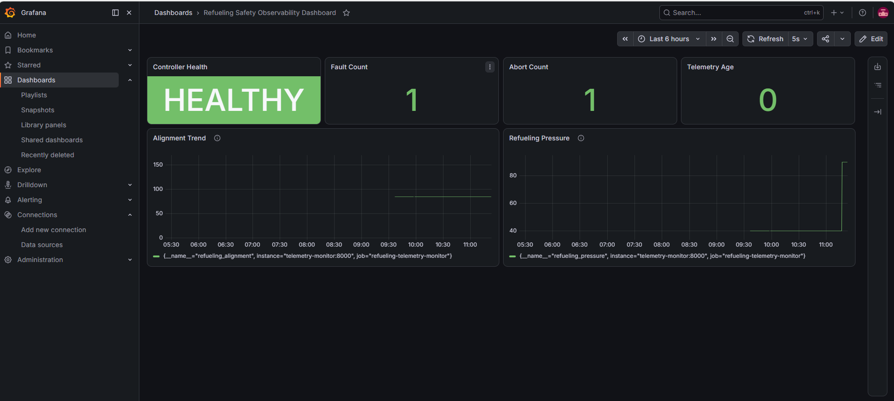
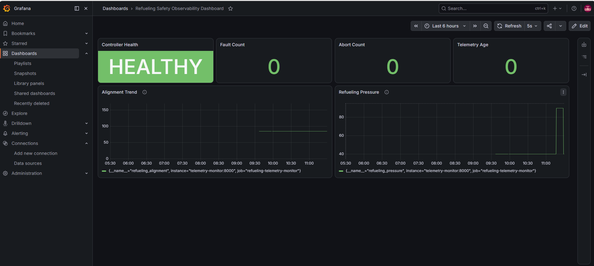

# Refueling Safety Observability Platform

A software-in-the-loop portfolio project that extends a deterministic C-based **Spacecraft Refueling Safety Simulation** into a local observability and incident-response platform.

The project demonstrates process lifecycle management, background telemetry ingestion, thread-safe caching, FastAPI health and metrics endpoints, Prometheus collection, Grafana visualization, Docker Compose deployment, incident runbooks, and an Agile-style GitHub workflow.

> This is a software-in-the-loop portfolio simulation. It is not intended for real spacecraft operation or physical hardware control.

---

## Current Status

**Current stage: Sprint 2 — Event-Driven Telemetry Foundation**

### Sprint 1 — Local Observability

Completed:

- Imported, built, and validated the deterministic C refueling controller
- Restored automatic safety checks during controller command processing
- Created the Python FastAPI telemetry monitor
- Added `GET /health` and Prometheus-compatible `GET /metrics`
- Parsed controller-generated `TLM` output
- Integrated the controller with Docker, FastAPI, Prometheus, and Grafana
- Added selectable `reset` and `pressure_high` software-in-the-loop scenarios
- Verified the pressure-high safety-abort path
- Captured Grafana evidence for faulted and recovered states
- Added pressure-high and telemetry-timeout runbooks
- Added Sprint 1 review and retrospective documentation
- Used GitHub Issues, Projects, and milestones to manage development

### Sprint 2 — Completed So Far

- **Issue 1:** Persistent simulator process
- **Issue 2:** Background telemetry reader
- **Issue 3:** Thread-safe latest telemetry cache and FastAPI cache integration

The current implementation now:

- Starts one C controller process during FastAPI startup
- Keeps the controller alive for the FastAPI service lifetime
- Uses one dedicated background thread as the controller stdout reader
- Separates command responses, telemetry observations, and diagnostics
- Stores the newest valid telemetry sample in a thread-safe cache
- Executes the configured startup scenario once
- Serves Prometheus metrics from cached telemetry
- Prevents Prometheus scrapes from sending controller commands
- Exposes controller, reader, and cache status through `/health`

### Current Next Step

**Issue 4 — Calculate real telemetry age**

The next change will calculate:

```text
current monotonic time - latest telemetry receive time
```

This will allow the monitoring layer to distinguish fresh telemetry from stale telemetry.

---

## Project Background

The original project was a spacecraft refueling safety simulation built around a deterministic C controller.

The controller manages refueling states, validates operating conditions, emits telemetry, records faults, and enters a safe abort state when a safety rule is violated.

This repository extends that controller into an observability platform while preserving a strict responsibility boundary:

```text
Deterministic C controller
    = safety decisions and state transitions

Python / FastAPI / Prometheus / Grafana
    = integration, observation, metrics, and visualization
```

---

## Current Architecture

### Service Startup Flow

```text
Docker Compose
      ↓
FastAPI service starts
      ↓
FastAPI lifespan starts one persistent C controller
      ↓
Background reader becomes the only controller stdout consumer
      ↓
Configured startup scenario runs once
      ↓
Controller emits telemetry
      ↓
Telemetry parser validates the TLM line
      ↓
Thread-safe latest telemetry cache is updated
```

### Prometheus Scrape Flow

```text
Prometheus GET /metrics
          ↓
FastAPI reads the latest cached telemetry sample
          ↓
Prometheus Gauges are updated
          ↓
FastAPI returns Prometheus exposition text
          ↓
Prometheus stores time-series data
          ↓
Grafana visualizes the metrics
```

### Key Architecture Rule

```text
Prometheus scrapes observe cached telemetry only.
They do not send controller commands.
They do not replay the simulator scenario.
They do not restart the C controller.
```

### Component View

```text
                    Safety-control boundary
┌──────────────────────────────────────────────────────────┐
│ Deterministic C Refueling Controller                     │
│                                                          │
│ State transitions · pressure validation · fault handling │
│ gate control · abort behavior · event logging            │
└──────────────────────────┬───────────────────────────────┘
                           │ controller stdout
                           ▼
             Python Background Telemetry Reader
                           │
                           ▼
            Thread-Safe Latest Telemetry Cache
                           │
                           ▼
                 FastAPI /health and /metrics
                           │
                           ▼
                       Prometheus
                           │
                           ▼
                         Grafana
```

The controller is currently command-driven. The background reader remains active, but new telemetry is produced only when the controller emits output. Periodic and event-driven telemetry publication will be added later.

---

## Safety-Control Boundary

The deterministic C controller remains responsible for:

- State transitions
- Pressure validation
- Alignment validation
- Fault detection
- Docking state
- Gate control
- Abort behavior
- Event logging

The Python service is responsible for:

- Starting and stopping the software-in-the-loop controller
- Sending controlled simulator commands
- Reading controller stdout
- Parsing telemetry
- Maintaining the latest telemetry cache
- Exposing health and metrics endpoints

Prometheus and Grafana only collect and visualize observations.

AI tools may support planning, debugging, testing, documentation, and incident summarization, but they do not control the refueling process or make safety-critical decisions.

---

## Technology Stack

- C
- Python 3.12
- FastAPI
- Uvicorn
- `prometheus-client`
- Prometheus
- Grafana
- Docker
- Docker Compose
- Git
- GitHub Issues, Projects, and Milestones

### Planned Extensions

- Real telemetry-age calculation
- Automated persistent-telemetry tests
- Prometheus alert rules
- Mosquitto MQTT broker
- MQTT telemetry publisher and consumer
- Additional incident scenarios and runbooks
- Alertmanager
- AWS observability workflow
- Kubernetes deployment
- Optional Go health-check service
- Optional AI-assisted incident triage

---

## Simulator Scenarios

The startup scenario is selected with the `SIMULATOR_SCENARIO` environment variable in `docker-compose.yml`.

The selected scenario runs once during FastAPI startup and initializes the latest telemetry cache.

### Reset Scenario

```yaml
environment:
  RUNNING_IN_DOCKER: "true"
  SIMULATOR_SCENARIO: "reset"
```

Startup command:

```text
RESET
```

Expected cached telemetry:

```text
STATE=IDLE
ALIGN=85
PRESSURE=40
FUEL=0
DOCK=0
GATE=CLOSED
FAULT=NONE
```

Expected metrics:

```text
refueling_alignment 85.0
refueling_pressure 40.0
refueling_fuel_level 0.0
refueling_docked 0.0
refueling_gate_open 0.0
refueling_fault_count 0.0
refueling_abort_count 0.0
refueling_controller_health 1.0
refueling_telemetry_age_seconds 0.0
```

### Pressure-High Scenario

```yaml
environment:
  RUNNING_IN_DOCKER: "true"
  SIMULATOR_SCENARIO: "pressure_high"
```

Startup command sequence:

```text
RESET
START_APPROACH
CHECK_ALIGNMENT
LOCK_DOCK
OPEN_GATE
CHECK_PRESSURE
START_REFUEL
SIM_PRESSURE 90
```

The deterministic C controller defines the safe pressure range as:

```text
Minimum safe pressure: 20
Maximum safe pressure: 80
```

Injecting pressure `90` produces:

```text
ACK,ABORT_ENTERING_SAFE_MODE,CAUSE=PRESSURE_OUT_OF_RANGE
```

Expected final cached telemetry:

```text
TLM,STATE=ABORT,ALIGN=85,PRESSURE=90,FUEL=0,DOCK=1,GATE=CLOSED,FAULT=PRESSURE_OUT_OF_RANGE
```

Expected metrics:

```text
refueling_alignment 85.0
refueling_pressure 90.0
refueling_fuel_level 0.0
refueling_docked 1.0
refueling_gate_open 0.0
refueling_fault_count 1.0
refueling_abort_count 1.0
refueling_controller_health 1.0
refueling_telemetry_age_seconds 0.0
```

Expected safety behavior:

- Controller state changes to `ABORT`
- Refueling gate closes
- Fault becomes `PRESSURE_OUT_OF_RANGE`
- Event log records `ABORT_PRESSURE_OUT_OF_RANGE`

---

## Implemented Endpoints

### Health Endpoint

```text
GET http://localhost:8000/health
```

Example reset response:

```json
{
  "status": "ok",
  "simulator_scenario": "reset",
  "controller_running": true,
  "controller_pid": 7,
  "reader_running": true,
  "reader_failure": null,
  "telemetry_available": true,
  "telemetry_sequence": 1
}
```

Fields:

| Field | Meaning |
|---|---|
| `status` | Overall monitor status: `ok` or `degraded` |
| `simulator_scenario` | Startup scenario selected through Docker Compose |
| `controller_running` | Whether the C controller process is alive |
| `controller_pid` | Current controller process ID |
| `reader_running` | Whether the background stdout reader thread is alive |
| `reader_failure` | Reader failure detail, or `null` when no failure is recorded |
| `telemetry_available` | Whether the latest telemetry cache contains a valid sample |
| `telemetry_sequence` | Sequence number of the newest cached sample |

These are intentionally separate concepts:

```text
controller process health
≠ reader health
≠ telemetry availability
≠ telemetry freshness
≠ controller safety state
```

A controller may be healthy as a process while correctly reporting an active safety fault or `ABORT` state.

### Metrics Endpoint

```text
GET http://localhost:8000/metrics
```

The endpoint:

1. Checks the shared persistent controller state.
2. Reads the latest telemetry sample from the cache.
3. Updates Prometheus Gauges from that sample.
4. Returns Prometheus-compatible exposition text.

The endpoint does not send `RESET`, replay `pressure_high`, or consume the telemetry observation queue.

When cached telemetry is unavailable or invalid, the endpoint returns HTTP `503`.

---

## Implemented Metrics

| Metric | Current Meaning |
|---|---|
| `refueling_alignment` | Latest controller-reported alignment value |
| `refueling_pressure` | Latest controller-reported line pressure |
| `refueling_fuel_level` | Latest controller-reported transferred fuel level |
| `refueling_docked` | Docked-state indicator |
| `refueling_gate_open` | Gate-open-state indicator |
| `refueling_fault_count` | Current fault-state indicator: `1 = active`, `0 = none` |
| `refueling_abort_count` | Current abort-state indicator: `1 = ABORT`, `0 = not ABORT` |
| `refueling_controller_health` | C controller process health: `1 = running`, `0 = unavailable` |
| `refueling_telemetry_age_seconds` | Placeholder telemetry age; real calculation is Issue 4 |

> Despite their current names, `refueling_fault_count` and `refueling_abort_count` are state indicators, not cumulative event counters. Metric-name cleanup is planned for Sprint 2.

> `refueling_telemetry_age_seconds` is currently fixed at `0`. Real age calculation will use the cached sample's monotonic receive timestamp.

---

## Persistent Cache Verification

The persistent telemetry architecture was verified with both supported startup scenarios.

### Reset Verification

Initial state:

```text
controller PID: 7
telemetry sequence: 1
```

After repeated `/metrics` scrapes:

```text
controller PID unchanged: True
telemetry sequence unchanged: True
```

This verifies that reset telemetry is cached and repeated Prometheus requests do not send another `RESET`.

### Pressure-High Verification

Initial state:

```text
controller PID: 7
telemetry sequence: 8
```

The sequence is `8` because the pressure-high startup scenario contains eight commands, and each command produces a telemetry sample. The cache is updated eight times and retains only the newest sample.

Final cached state:

```text
STATE=ABORT
PRESSURE=90
GATE=CLOSED
FAULT=PRESSURE_OUT_OF_RANGE
```

After repeated `/metrics` scrapes:

```text
controller PID unchanged: True
telemetry sequence unchanged: True
```

This verifies that Prometheus observes the cached `ABORT` state without replaying the eight-command scenario.

---

## Docker Compose Deployment

The local stack contains:

- `telemetry-monitor`
- `prometheus`
- `grafana`

Start or rebuild the complete stack:

```powershell
docker compose up -d --build
```

Rebuild only the telemetry monitor:

```powershell
docker compose up -d --build telemetry-monitor
```

Force recreation after changing the startup scenario:

```powershell
docker compose up -d --build --force-recreate telemetry-monitor
```

Check service status:

```powershell
docker compose ps
```

View telemetry-monitor logs:

```powershell
docker compose logs --tail 50 telemetry-monitor
```

Stop the stack:

```powershell
docker compose down
```

Grafana runtime data is persisted through the named Docker volume:

```yaml
volumes:
  grafana-data:
```

Local Grafana backup data is intentionally excluded from Git.

---

## Local Service URLs

| Service | URL |
|---|---|
| FastAPI health | `http://localhost:8000/health` |
| FastAPI metrics | `http://localhost:8000/metrics` |
| FastAPI docs | `http://localhost:8000/docs` |
| Prometheus | `http://localhost:9090` |
| Prometheus targets | `http://localhost:9090/targets` |
| Grafana | `http://localhost:3000` |

---

## Prometheus Integration

Prometheus scrapes the telemetry monitor every five seconds.

```yaml
global:
  scrape_interval: 5s

scrape_configs:
  - job_name: "refueling-telemetry-monitor"
    static_configs:
      - targets:
          - "telemetry-monitor:8000"
```

Prometheus has been verified to:

- Reach the FastAPI `/metrics` endpoint
- Report the telemetry-monitor target as `UP`
- Query refueling metrics
- Store time-series history
- Supply data to Grafana
- Scrape repeatedly without changing the controller PID or telemetry sequence

---

## Grafana Dashboard

The Grafana dashboard includes:

- Controller Health
- Fault Count
- Abort Count
- Telemetry Age
- Alignment Trend
- Refueling Pressure Trend

Dashboard definition:

```text
grafana/dashboards/refueling_safety_observability_dashboard.json
```

### Pressure-High Evidence



### Recovered Reset Evidence



Prometheus retains time-series history, so trend panels may continue to display earlier samples after switching back to the reset scenario.

---

## Incident Runbooks

Implemented runbooks:

```text
runbooks/
├── pressure_high.md
└── telemetry_timeout.md
```

### Pressure-High Runbook

Documents:

- Trigger condition
- Safe pressure thresholds
- Expected controller response
- Expected telemetry and metrics
- Grafana indicators
- Investigation commands
- Safe recovery steps
- Recovery verification
- Current software-in-the-loop limitations

### Telemetry-Timeout Runbook

Documents:

- Timeout symptoms
- Health, metrics, Prometheus, and Grafana checks
- Docker and subprocess investigation
- Controller executable verification
- Safe restart and rebuild procedures
- Recovery verification
- Escalation and follow-up guidance

The timeout runbook will be updated after Issue 4 adds real telemetry-age calculation and a documented stale-telemetry threshold.

---

## Repository Structure

```text
refueling-observability-platform/
├── controller/
│   └── controller.c
├── telemetry_monitor/
│   ├── app.py
│   ├── simulator_client.py
│   ├── telemetry_parser.py
│   ├── Dockerfile
│   └── requirements.txt
├── prometheus/
│   └── prometheus.yml
├── grafana/
│   └── dashboards/
│       └── refueling_safety_observability_dashboard.json
├── docs/
│   ├── images/
│   │   ├── grafana_simulator_mode_dashboard_PRESSURE_HIGH.png
│   │   └── grafana_simulator_mode_dashboard_RESET.png
│   ├── sprint_reviews/
│   └── retrospectives/
├── runbooks/
│   ├── pressure_high.md
│   └── telemetry_timeout.md
├── docker-compose.yml
├── .gitignore
└── README.md
```

---

## Manual Controller Verification

Run the C controller interactively inside the telemetry-monitor container:

```powershell
docker exec -it refueling-telemetry-monitor /controller/controller
```

Then enter:

```text
RESET
START_APPROACH
CHECK_ALIGNMENT
LOCK_DOCK
OPEN_GATE
CHECK_PRESSURE
START_REFUEL
SIM_PRESSURE 90
GET_STATUS
GET_LOG
```

Expected safety result:

```text
STATE=ABORT
PRESSURE=90
GATE=CLOSED
FAULT=PRESSURE_OUT_OF_RANGE
```

> This command starts a separate manual controller process inside the container. It does not attach to the controller process already owned by FastAPI.

---

## Simulator Client Verification

Run:

```powershell
docker exec refueling-telemetry-monitor python simulator_client.py
```

Expected pressure-high result includes:

```text
STATE: ABORT
ALIGN: 85
PRESSURE: 90
FUEL: 0
DOCK: 1
GATE: CLOSED
FAULT: PRESSURE_OUT_OF_RANGE
```

The standalone verification also checks:

- One controller process per client lifecycle
- One background reader thread
- Telemetry sequencing
- Latest-cache behavior
- Defensive cache copying
- Reader shutdown
- Cache reset after shutdown

> Running `simulator_client.py` directly executes its standalone verification routine and temporarily starts a separate test controller process. It does not inspect or replace the controller owned by FastAPI.

---

## Current Implemented Scope

- Deterministic C safety controller
- Software-in-the-loop command scenarios
- Controller-generated telemetry
- Persistent controller process
- Background stdout reader
- Independent command-response and observation queues
- Diagnostic handling
- Telemetry sequence numbers
- Monotonic telemetry receive timestamps
- Thread-safe latest telemetry cache
- Defensive cache copies
- FastAPI lifespan-based startup and shutdown
- Startup-only scenario initialization
- Cache-based `/metrics`
- Expanded `/health`
- Prometheus scraping
- Grafana dashboard
- Docker Compose local stack
- Persistent Grafana volume
- Reset and pressure-high scenarios
- Incident evidence and runbooks
- GitHub Project and sprint-style workflow

---

## Current Limitations

- The configured simulator scenario runs once during FastAPI startup.
- The controller is command-driven and does not yet emit periodic telemetry without new simulator activity.
- The latest-value cache stores only the newest valid sample, not full event history.
- Real telemetry age is not yet calculated; the metric remains fixed at zero.
- A stale-telemetry threshold is not yet implemented.
- Fault and abort metrics are state indicators rather than cumulative counters.
- Automated regression tests are not yet implemented under a dedicated test suite.
- MQTT event distribution and consumers are not yet implemented.
- Prometheus alert rules and Alertmanager are not yet configured.
- Recovery from the pressure-high startup scenario requires changing the scenario back to `reset` and recreating the service.
- The platform uses software-in-the-loop telemetry rather than physical spacecraft hardware telemetry.

---

## Agile-Style Workflow

This is a personal portfolio project and does not claim to use a full company-level Scrum process.

Development is managed using GitHub Issues, GitHub Projects, and sprint-style milestones, including:

- Feature tickets
- Bug reports
- Documentation tasks
- Incident tasks
- Acceptance criteria
- Issue-to-commit tracking
- Sprint reviews
- Retrospectives

Current Sprint 2 progression:

```text
Persistent controller process                  ✅
Background telemetry reader                    ✅
Latest telemetry cache and FastAPI integration ✅
Real telemetry age                             Next
Automated tests                                Planned
Metric semantics cleanup                       Planned
MQTT event-driven telemetry                    Planned
Prometheus alert rules                         Planned
Additional incident scenarios and runbooks     Planned
```

---

## Future Roadmap

### Sprint 2 — Persistent and Event-Driven Telemetry

- Calculate real telemetry age
- Define stale-telemetry behavior and threshold
- Add automated tests
- Clarify metric semantics
- Add Mosquitto to Docker Compose
- Define an MQTT JSON event schema
- Add telemetry publisher
- Add telemetry and incident consumer
- Implement additional incident scenarios
- Add Prometheus alert rules
- Update Grafana evidence and runbooks

Example MQTT topics:

```text
refueling/telemetry
refueling/status
refueling/faults
refueling/alerts
```

### Phase 3 — AWS Incident Workflow

- EC2 deployment
- S3 telemetry archive
- CloudWatch log review
- Lambda incident parser
- SNS alert workflow

### Phase 4 — Kubernetes and Go Add-On

- Kubernetes manifests
- Liveness and readiness probes
- Pod-failure simulation
- `kubectl` troubleshooting documentation
- Optional Go health-check service
- `/health`, `/ready`, and `/metrics`

### Phase 5 — AI-Assisted Incident Triage

- Log summarization
- Incident classification
- Runbook lookup
- Metrics snapshot interpretation
- Postmortem drafting

Any AI module will remain outside the deterministic safety-control boundary.

---

## AI and Safety Boundaries

AI tools may support:

- Code explanation
- Debugging strategy
- Test-case planning
- Log summarization
- Incident summary drafting
- Runbook drafting
- Documentation improvement

AI tools do not make safety-critical decisions.

Abort behavior, fault detection, gate control, and state transitions remain deterministic and are manually verified through repeatable commands, telemetry, logs, metrics, and dashboards.

---

## Related Project

This project builds on:

[Spacecraft Refueling Safety Simulation](https://github.com/bmslate/spacecraft-refueling-safety-sim)

The original project focuses on deterministic C safety-control logic. This repository extends it with process integration, telemetry monitoring, observability, incident-response documentation, and future event-driven reliability workflows.
